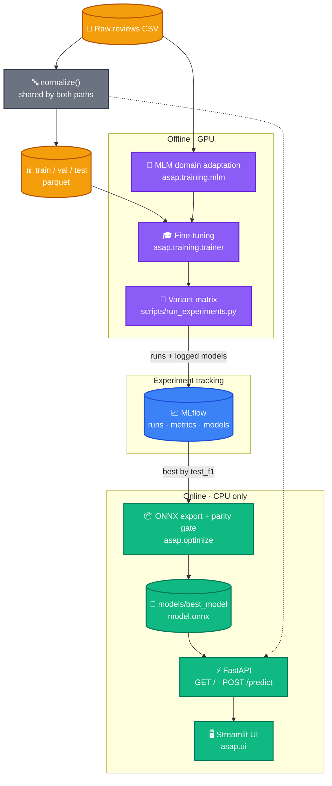

# Arabic Sentiment Analysis

An end-to-end MLOps pipeline for binary sentiment classification of Arabic
product reviews. Covers data preparation, domain-adaptive pretraining, tracked
experimentation across encoders, ONNX export with verified numerical fidelity,
and a FastAPI service that runs on CPU alone.


**Current model:** AraBERTv02 fine-tuned on 247k Arabic reviews —
**0.948 weighted F1** in fp32, served as INT8 ONNX at **0.944 F1** and
**22 ms** uncontended on CPU. See the [experiment report](reports/experiments.md)
for how it was chosen.

## 🎯 Features

- **Arabic sentiment classification** — positive / negative, with confidence
  scores, from a fine-tuned transformer.
- **Tracked experimentation** — every run records its git SHA, hyperparameters
  and metrics to MLflow; the best model is selected server-side by query, not
  by hand.
- **CPU-only serving** — no GPU and no PyTorch in the serving environment;
  ONNX Runtime alone, in a ~300 MB install.
- **INT8 quantization** — a 4× smaller graph serving 1.6× the throughput, for
  0.68 F1 points. `asap-quantize` measures the trade before it is taken.
- **FastAPI backend** — single prediction with request validation, and a health
  endpoint reporting the resolved execution provider.

## 🏗️ Architecture

Two distinct paths share one preprocessing function. The training path is
offline and GPU-bound; the serving path is online and carries no PyTorch at
all.



## 🚀 Quick Start

### Prerequisites

- **Python 3.11+**
- **[uv](https://docs.astral.sh/uv/)** for dependency management
- **NVIDIA GPU with CUDA 12.1** — only for training; serving and inference are
  CPU-only

### Serving an existing model

The lightest install: CPU-only ONNX Runtime, no PyTorch. On a GPU host, use
`--extra onnx` instead.

```bash
git clone https://github.com/Asem-Saber/ASAP.git
cd ASAP
uv sync --extra serve
```

```bash
uv run asap-api
```

- API: http://127.0.0.1:8000
- Interactive docs: http://127.0.0.1:8000/docs

Startup takes 30–40 seconds: the service loads the graph and runs a warmup
inference before binding the port.

```bash
curl -s -X POST http://127.0.0.1:8000/predict \
  -H "Content-Type: application/json" \
  -d '{"text":"المنتج رائع جدا وانصح به بشدة"}'
```

```json
{ "sentiment": "positive", "confidence": 0.9969896078109741 }
```

> `models/` is gitignored, so a fresh clone has no weights. Train and export
> first, or drop an exported graph into `models/best_model/`.

### Streamlit UI

A one-box UI over the same `/predict` route. It is an HTTP client, not a second
inference path — the API must be running first.

```bash
uv sync --extra serve --extra ui
```

> `uv sync` is exact: it removes anything outside the extras you name. If you
> already have the full development install, add the extra without tearing the
> rest out:
>
> ```bash
> uv sync --inexact --extra ui
> ```

```bash
uv run asap-api        # terminal 1
uv run asap-ui         # terminal 2
```

The UI opens at http://localhost:8501 with four preset Arabic reviews to try.
To point it at a service elsewhere:

```bash
ASAP_UI__API_URL=https://my-api.example.com uv run asap-ui
```

The UI calls the API from its own Python process, so the API has to be
reachable from wherever the UI runs. `config/config.yml` binds the API to
`127.0.0.1`, which only accepts local connections. For a remote API, bind it
beyond loopback with `ASAP_API__HOST=0.0.0.0` or put it behind a proxy.

### Full development install

```bash
uv sync --extra onnx --extra export --extra train --extra cu121 --extra dev --extra track
```

Swap `--extra cu121` for `--extra cpu` on a machine without an NVIDIA GPU.

## Deployment

Both services run as containers. One multi-stage `Dockerfile` produces two
images — only the API image carries ONNX Runtime, while both share the
project's base dependencies.

```bash
docker compose up --build
```

- API: http://127.0.0.1:8000
- UI: http://127.0.0.1:8501

The UI waits on the API's healthcheck, so the UI only becomes reachable once
the model is loaded and warmed up, which takes tens of seconds on a cold start.
Compose stops waiting after about two minutes; at that point `docker compose
up` fails and the UI is never started.

### Weights

`models/` is gitignored and **not** baked into the image. Compose mounts it
read-only:

```yaml
volumes:
  - ./models:/app/models:ro
```

So a host without `models/best_model/model.onnx` will start the API container
and have it exit. Because the UI depends on the API's healthcheck,
`docker compose up` then aborts on the unhealthy dependency and the UI
container is never created. Train and export first, or drop an exported graph
in.

This also means the image alone is not self-contained. It deploys to anywhere
with persistent storage — a VPS, Fly.io volumes, ECS with EFS — but on Hugging
Face Spaces, or a bare `docker run` on a fresh host, the weights have to be
supplied separately. Baking them takes two changes: a `COPY` in the `api` stage
and dropping `models/` from `.dockerignore`.

### Configuration in containers

Two `ASAP_` overrides are in play, through the usual mechanism: the `api` image
sets one and compose sets the other:

| Variable | Set by | Value | Why |
|---|---|---|---|
| `ASAP_API__HOST` | the `api` image | `0.0.0.0` | `config.yml` binds `127.0.0.1`, which inside a container is the container's own loopback — the published port would refuse every connection |
| `ASAP_UI__API_URL` | compose | `http://api:8000` | the UI reaches the API by compose service name; its config default would point at the UI container itself |

Ports publish to `127.0.0.1`, so `docker compose up` does not expose the UI
to your network.

## 📋 Configuration

All settings live in `config/config.yml`, typed in `src/asap/config.py`, and
are read through `asap.config.get_settings()` — no literal paths or
hyperparameters anywhere else.

```yaml
paths:
  raw_csv: data/raw/arabic_sentiment_reviews.csv
  processed_dir: data/processed
  onnx_dir: models/best_model        # export target
  experiments_dir: models/experiments # per-variant checkpoints
  bench_sample: data/sample_reviews.jsonl  # load-test fixture

inference:
  model_dir: models/best_model       # what the API serves
  model_file: model_quantized.onnx   # or model.onnx — see Quantization
  provider: CPUExecutionProvider
  intra_op_num_threads: 4            # machine-specific; see Performance
  max_length: 128
  batch_size: 32

api:
  max_concurrent_inference: 3        # concurrent inference calls admitted

ui:
  api_url: null                      # null -> http://{api.host}:{api.port}
  request_timeout: 20.0

tracking:
  uri: sqlite:///mlruns.db
  experiment: asap-sentiment
  primary_metric: test_f1
  greater_is_better: true
```

Any value can be overridden by environment variable using the `ASAP_` prefix
with `__` for nesting:

```bash
ASAP_INFERENCE__PROVIDER=CUDAExecutionProvider
ASAP_TRAINING__CLASSIFIER__LEARNING_RATE=3e-5
```

List- and dict-valued settings are parsed as JSON and need bracket syntax.

### Dependency extras

Dependencies are split by role so a serving install stays small.

| Extra | Purpose | Notable contents |
|---|---|---|
| `onnx` | Serving, GPU-capable host | `onnxruntime-gpu` |
| `serve` | Serving, CPU only (containers) | `onnxruntime` — no CUDA kernels, ~260 MB smaller |
| `export` | ONNX conversion | `onnx` (also requires a torch extra) |
| `train` | Training and data prep | `datasets`, `scikit-learn`, `pandas` |
| `track` | Experiment tracking | `mlflow` |
| `dev` | Tests | `pytest`, `pytest-cov`, `httpx2` |
| `ui` | Streamlit UI | `streamlit`, `httpx` |
| `bench` | Load testing | `locust`, `urllib3>=2` |
| `cpu` / `cu121` | PyTorch build, mutually exclusive | `torch 2.5.1` |

## 🏗️ Project Structure

```
Arabic-Sentiment-Analysis/
├── src/asap/
│   ├── config.py                  # Typed settings, single source of truth
│   ├── preprocessing.py           # normalize() — shared by training & serving
│   ├── api/
│   │   ├── app.py                 # FastAPI app, lifespan model loading
│   │   ├── routes.py              # /, /predict
│   │   ├── schemas.py             # Pydantic request/response models
│   │   └── deps.py                # Protocol-typed model dependency
│   ├── inference/
│   │   ├── base.py                # SentimentModel Protocol
│   │   └── predictor.py           # ONNX Runtime session + tokenizer
│   ├── ui/
│   │   ├── app.py                 # Streamlit view
│   │   ├── client.py              # httpx client for /predict
│   │   ├── examples.py            # preset Arabic reviews
│   │   └── cli.py                 # `asap-ui` launcher
│   ├── data/
│   │   └── build.py               # Dedup, filter, stratified splits
│   ├── training/
│   │   ├── mlm.py                 # Domain-adaptive MLM pretraining
│   │   ├── trainer.py             # Classifier fine-tuning
│   │   └── experiment.py          # Variant declarations, ranking rule
│   ├── tracking/
│   │   ├── context.py             # Git/data provenance (no mlflow import)
│   │   └── mlflow_run.py          # Run lifecycle
│   └── optimize/
│       ├── export_onnx.py         # torch.onnx export with dynamic axes
│       ├── quantize.py            # INT8 dynamic quantization + quality gate
│       └── verify.py              # ONNX ↔ checkpoint parity checks
├── benchmarks/
│   ├── locustfile.py              # load shapes for /predict and /
│   └── runs/                      # recorded run artifacts (csv, html, charts)
├── scripts/
│   ├── run_experiments.py         # Train all variants, rank, export winner
│   └── sample_data.py             # Build the load-test fixture
├── tests/                         # pytest suite
├── config/
│   ├── config.yml                 # Application settings
│   └── experiments.yml            # Variant matrix
├── reports/
│   ├── benchmark.md               # fp32 vs INT8 serving comparison
│   ├── experiments.md             # Encoder comparison results
│   └── figures/                   # Generated from the tracking store
├── notebooks/                     # Exploratory work, MLM prototype
├── .github/workflows/ci.yml       # Tests + coverage on push
├── Dockerfile                     # api and ui build targets
├── docker-compose.yml             # both services, healthcheck, weights mount
└── pyproject.toml
```

## 🛠️ Development

### Running the pipeline

```bash
# 1. Build the splits
python -m asap.data.build

# 2. Optional: domain-adaptive MLM pretraining
python -m asap.training.mlm

# 3. Train every variant, track, rank — without touching the served model
python scripts/run_experiments.py --no-export

# 4. Publish the winner: export to ONNX, verify, register
python scripts/run_experiments.py --only <variant>
```

Variants are declared in `config/experiments.yml`. Adding one is a config
change, not a code change.

### Exporting a checkpoint directly

```bash
uv run asap-export-onnx --src models/experiments/arabic-base --out models/best_model
```

### Quantizing a graph

```bash
uv run asap-quantize --check
```

Writes `model_quantized.onnx` beside `model.onnx` and measures it against the
fp32 graph. Exits non-zero when the measured drop exceeds the thresholds in
`asap.optimize.quantize`.

### Load testing

```bash
python scripts/sample_data.py            # once — builds the fixture
uv run asap-api                          # terminal 1
locust -f benchmarks/locustfile.py       # terminal 2
```

Results from recorded runs live in [`reports/benchmark.md`](reports/benchmark.md).

### Inspecting experiments

```bash
mlflow ui --backend-store-uri sqlite:///mlruns.db
```

### Tests

```bash
# Fast suite — no model artifacts required
uv run pytest -m "not gpu and not slow"

# Everything, including export and parity checks
uv run pytest -m ""

# Full torch-vs-ONNX parity on the served graph
ASAP_VERIFY_SOURCE=models/experiments/arabic-base uv run pytest -m slow
```

Tests requiring real checkpoints are marked `slow` and skip when the artifacts
are absent, so a clean clone stays green.

## 🧪 Model & Results

Three encoders were compared under identical conditions — same splits, learning
rate, epochs and sequence length — so each difference is attributable to the
encoder alone.

| Variant | Base encoder | test F1 | Δ vs baseline |
|---|---|---|---|
| **arabic-base** | `aubmindlab/bert-base-arabertv02` | **0.9482** | **+0.0204** |
| mlm | DistilBERT + domain-adaptive MLM | 0.9306 | +0.0028 |
| baseline | `distilbert-base-multilingual-cased` | 0.9278 | — |

An Arabic-specific encoder gained two points of F1; domain-adaptive MLM
pretraining gained 0.28, which a single seed cannot distinguish from noise.
Full analysis, training curves and limitations are in
[`reports/experiments.md`](reports/experiments.md).

### Export verification

Every exported graph is compared against the checkpoint it came from before it
can be served:

| Check | Result |
|---|---|
| Label agreement with PyTorch | 1.0 |
| Logit shift from batching | 0.0 |
| Max absolute logit delta | 7.15e-06 |

The batching check matters most: a sequence axis frozen during tracing produces
correct results on single inputs and only diverges when a short input is padded
up beside a long one.

### Quantization

`asap-quantize` applies INT8 dynamic quantization — no calibration set required.
The result is selected at serve time through `inference.model_file`, so
switching is a config change rather than a code change.

| Measure | fp32 | INT8 | Change |
|---|---:|---:|---|
| Graph size | 541.0 MB | **136.0 MB** | 3.98× smaller |
| `/predict` throughput | 8.89 rps | **14.20 rps** | 1.60× faster |
| `test_f1` | 0.9504 | 0.9436 | −0.0068 |
| Label agreement vs fp32 | — | 0.9688 | 3.1% of labels change |

**INT8 is the served default.** The accuracy cost is a deliberate trade for
throughput and footprint. A workload where a 3% label change is material should
re-weigh it. Static quantization with a calibration set would likely recover
most of the F1 at the same speed, and is the next refinement.

## 📈 Performance

Measured on a 12th Gen Intel i7-12700 (12 physical / 20 logical cores),
128-token inputs, via [`benchmarks/locustfile.py`](benchmarks/locustfile.py) at
100 concurrent users.

| | fp32 | INT8 | Change |
|---|---:|---:|---|
| `/predict` throughput | 8.89 rps | **14.20 rps** | 1.60× |
| Uncontended latency | 39 ms | **22.4 ms** | 1.74× |
| p95 under load | 10.0 s | **5.2 s** | 1.92× |
| Graph size | 541 MB | **136 MB** | 3.98× |

Full method, charts and caveats: [`reports/benchmark.md`](reports/benchmark.md).

`intra_op_num_threads` is **machine-specific and deliberately not left at the
default**. ONNX Runtime otherwise spawns one thread per physical core, and for
a model this size the synchronisation overhead costs more than the parallelism
returns — measurably slower at 12 threads than at 4. Re-measure on new
hardware.

Concurrency is bounded by `api.max_concurrent_inference` (default 3). Raising it
does **not** raise throughput: a sweep over `1×4`, `3×4`, `6×2` and `12×1`
pairings of limiter and thread count held near 10 rps throughout. Roughly 99.6%
of a request is `session.run`, so model cost — not request concurrency — sets
the ceiling. Remaining stages are in
[`docs/superpowers/specs/2026-09-26-serving-performance-design.md`](docs/superpowers/specs/2026-09-26-serving-performance-design.md).

## 📝 License

This project is licensed under the MIT License. See the [LICENSE](LICENSE) file for details.