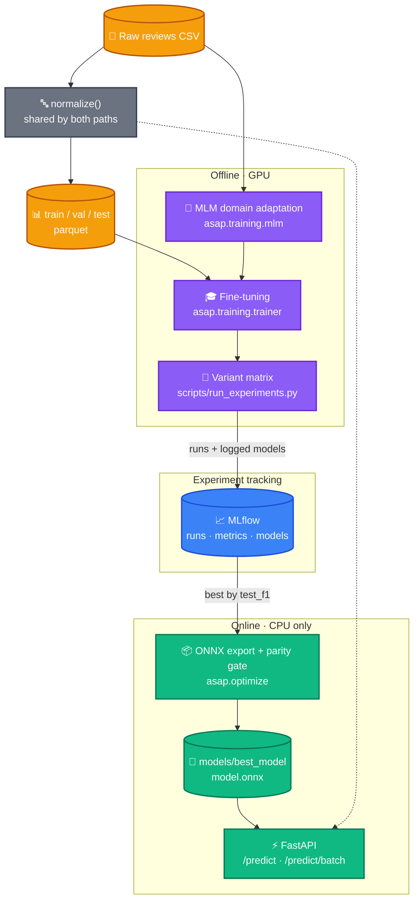

# Arabic Sentiment Analysis

An end-to-end MLOps pipeline for binary sentiment classification of Arabic
product reviews. Covers data preparation, domain-adaptive pretraining, tracked
experimentation across encoders, ONNX export with verified numerical fidelity,
and a FastAPI service that runs on CPU alone.


**Current model:** AraBERTv02 fine-tuned on 247k Arabic reviews —
**0.948 weighted F1** on a held-out test split, served as ONNX at
**95 ms p50** on CPU. See the [experiment report](reports/experiments.md) for
how it was chosen.

## 🎯 Features

- **Arabic sentiment classification** — positive / negative, with confidence
  scores, from a fine-tuned transformer.
- **One preprocessing path** — the same `normalize()` runs in training and
  serving, so the model never sees text it was not trained on.
- **Tracked experimentation** — every run records its git SHA, hyperparameters
  and metrics to MLflow; the best model is selected server-side by query, not
  by hand.
- **Verified ONNX export** — the exported graph is checked against its source
  checkpoint before it can be promoted, and publication is refused if they
  disagree.
- **CPU-only serving** — no GPU and no PyTorch in the serving environment;
  ONNX Runtime alone, in a ~300 MB install.
- **FastAPI backend** — single and batch prediction, with request validation
  and a health endpoint reporting the resolved execution provider.

## 🏗️ Architecture

Two distinct paths share one preprocessing function. The training path is
offline and GPU-bound; the serving path is online and carries no PyTorch at
all.



## 🚀 Quick Start

### Prerequisites

- **Python 3.11+**
- **[uv](https://docs.astral.sh/uv/)** for dependency management
- **NVIDIA GPU with CUDA 12.1** — only for training; serving and inference are
  CPU-only

### Serving an existing model

The lightest install: ONNX Runtime only, no PyTorch.

```bash
git clone https://github.com/Asem-Saber/ASAP.git
cd ASAP
uv sync --extra onnx
```

```bash
uv run asap-api
```

- API: http://127.0.0.1:8000
- Interactive docs: http://127.0.0.1:8000/docs

Startup takes 30–40 seconds: the service loads the graph and runs a warmup
inference before binding the port.

```bash
curl -s -X POST http://127.0.0.1:8000/predict \
  -H "Content-Type: application/json" \
  -d '{"text":"المنتج رائع جدا وانصح به بشدة"}'
```

```json
{ "sentiment": "positive", "confidence": 0.9969896078109741 }
```

> `models/` is gitignored, so a fresh clone has no weights. Train and export
> first, or drop an exported graph into `models/best_model/`.

### Full development install

```bash
uv sync --extra onnx --extra export --extra train --extra cu121 --extra dev --extra track
```

Swap `--extra cu121` for `--extra cpu` on a machine without an NVIDIA GPU.

## 📋 Configuration

All settings live in `config/config.yml`, typed in `src/asap/config.py`, and
are read through `asap.config.get_settings()` — no literal paths or
hyperparameters anywhere else.

```yaml
paths:
  raw_csv: data/raw/arabic_sentiment_reviews.csv
  processed_dir: data/processed
  onnx_dir: models/best_model        # export target
  experiments_dir: models/experiments # per-variant checkpoints

inference:
  model_dir: models/best_model       # what the API serves
  model_file: model.onnx
  provider: CPUExecutionProvider
  intra_op_num_threads: 4            # machine-specific; see Performance
  max_length: 128
  batch_size: 32

tracking:
  uri: sqlite:///mlruns.db
  experiment: asap-sentiment
  primary_metric: test_f1
  greater_is_better: true
```

Any value can be overridden by environment variable using the `ASAP_` prefix
with `__` for nesting:

```bash
ASAP_INFERENCE__PROVIDER=CUDAExecutionProvider
ASAP_TRAINING__CLASSIFIER__LEARNING_RATE=3e-5
```

List- and dict-valued settings are parsed as JSON and need bracket syntax.

### Dependency extras

Dependencies are split by role so a serving install stays small.

| Extra | Purpose | Notable contents |
|---|---|---|
| `onnx` | Serving | `onnxruntime-gpu` — the only runtime the API needs |
| `export` | ONNX conversion | `onnx` (also requires a torch extra) |
| `train` | Training and data prep | `datasets`, `scikit-learn`, `pandas` |
| `track` | Experiment tracking | `mlflow` |
| `dev` | Tests | `pytest`, `pytest-cov`, `httpx2` |
| `cpu` / `cu121` | PyTorch build, mutually exclusive | `torch 2.5.1` |

## 🏗️ Project Structure

```
Arabic-Sentiment-Analysis/
├── src/asap/
│   ├── config.py                  # Typed settings, single source of truth
│   ├── preprocessing.py           # normalize() — shared by training & serving
│   ├── api/
│   │   ├── app.py                 # FastAPI app, lifespan model loading
│   │   ├── routes.py              # /, /predict, /predict/batch
│   │   ├── schemas.py             # Pydantic request/response models
│   │   └── deps.py                # Protocol-typed model dependency
│   ├── inference/
│   │   ├── base.py                # SentimentModel Protocol
│   │   └── predictor.py           # ONNX Runtime session + tokenizer
│   ├── data/
│   │   └── build.py               # Dedup, filter, stratified splits
│   ├── training/
│   │   ├── mlm.py                 # Domain-adaptive MLM pretraining
│   │   ├── trainer.py             # Classifier fine-tuning
│   │   └── experiment.py          # Variant declarations, ranking rule
│   ├── tracking/
│   │   ├── context.py             # Git/data provenance (no mlflow import)
│   │   └── mlflow_run.py          # Run lifecycle
│   └── optimize/
│       ├── export_onnx.py         # torch.onnx export with dynamic axes
│       └── verify.py              # ONNX ↔ checkpoint parity checks
├── scripts/
│   └── run_experiments.py         # Train all variants, rank, export winner
├── tests/                         # 100 tests, pytest
├── config/
│   ├── config.yml                 # Application settings
│   └── experiments.yml            # Variant matrix
├── reports/
│   ├── experiments.md             # Encoder comparison results
│   └── figures/                   # Generated from the tracking store
├── notebooks/                     # Exploratory work, MLM prototype
├── .github/workflows/ci.yml       # Tests + coverage on push
└── pyproject.toml
```

## 🛠️ Development

### Running the pipeline

```bash
# 1. Build the splits
python -m asap.data.build

# 2. Optional: domain-adaptive MLM pretraining
python -m asap.training.mlm

# 3. Train every variant, track, rank — without touching the served model
python scripts/run_experiments.py --no-export

# 4. Publish the winner: export to ONNX, verify, register
python scripts/run_experiments.py --only <variant>
```

Variants are declared in `config/experiments.yml`. Adding one is a config
change, not a code change.

### Exporting a checkpoint directly

```bash
uv run asap-export-onnx --src models/experiments/arabic-base --out models/best_model
```

### Inspecting experiments

```bash
mlflow ui --backend-store-uri sqlite:///mlruns.db
```

### Tests

```bash
# Fast suite — no model artifacts required
uv run pytest -m "not gpu and not slow"

# Everything, including export and parity checks
uv run pytest -m ""

# Full torch-vs-ONNX parity on the served graph
ASAP_VERIFY_SOURCE=models/experiments/arabic-base uv run pytest -m slow
```

Tests requiring real checkpoints are marked `slow` and skip when the artifacts
are absent, so a clean clone stays green.

## 🧪 Model & Results

Three encoders were compared under identical conditions — same splits, learning
rate, epochs and sequence length — so each difference is attributable to the
encoder alone.

| Variant | Base encoder | test F1 | Δ vs baseline |
|---|---|---|---|
| **arabic-base** | `aubmindlab/bert-base-arabertv02` | **0.9482** | **+0.0204** |
| mlm | DistilBERT + domain-adaptive MLM | 0.9306 | +0.0028 |
| baseline | `distilbert-base-multilingual-cased` | 0.9278 | — |

An Arabic-specific encoder gained two points of F1; domain-adaptive MLM
pretraining gained 0.28, which a single seed cannot distinguish from noise.
Full analysis, training curves and limitations are in
[`reports/experiments.md`](reports/experiments.md).

### Export verification

Every exported graph is compared against the checkpoint it came from before it
can be served:

| Check | Result |
|---|---|
| Label agreement with PyTorch | 1.0 |
| Logit shift from batching | 0.0 |
| Max absolute logit delta | 7.15e-06 |

The batching check matters most: a sequence axis frozen during tracing produces
correct results on single inputs and only diverges when a short input is padded
up beside a long one.

## 📈 Performance

Measured on an RTX 3060 Ti host, 12 physical CPU cores, 128-token inputs.

| Configuration | p50 | p95 |
|---|---|---|
| CPU, 4 threads (current) | **95 ms** | 163 ms |
| CPU, all cores | 292 ms | 366 ms |

`intra_op_num_threads` is **machine-specific and deliberately not left at the
default**. ONNX Runtime otherwise spawns one thread per physical core, and for
a model this size the synchronisation overhead costs more than the parallelism
returns — measurably slower at 12 threads than at 4. Re-measure on new
hardware.

Requests are currently served one at a time. Raising concurrency, quantization
and adaptive batching are staged in
[`docs/superpowers/specs/2026-09-26-serving-performance-design.md`](docs/superpowers/specs/2026-09-26-serving-performance-design.md).

## 🔒 Notes on Correctness

- **One preprocessing path.** `normalize()` is shared by training and serving,
  which removes the most common source of train/serve skew.
- **Export is gated, not assumed.** A graph whose predictions disagree with its
  checkpoint is refused rather than published.
- **Selection is reproducible.** The best model is chosen by querying MLflow,
  not by an in-process comparison, so the ranking can be re-derived from the
  tracking store alone.
- **Provenance is recorded.** Runs carry a git SHA and a dirty-tree flag.
  Dataset fingerprinting via DVC is not yet wired in.
- **Input validation.** Request size and batch limits are enforced by Pydantic
  schemas; an unknown execution provider is rejected at startup rather than
  silently falling back.

## 🗺️ Roadmap

- [x] Shared preprocessing, stratified splits
- [x] MLM domain adaptation
- [x] Experiment tracking and model selection (MLflow)
- [x] ONNX export with verified parity
- [x] CPU-only FastAPI serving
- [ ] Data and pipeline versioning (DVC)
- [ ] INT8 quantization
- [ ] Concurrency and adaptive batching
- [ ] Containerized deployment

## 📝 License

MIT — see [LICENSE](LICENSE).

## 🤝 Contributing

Contributions are welcome:

1. Fork the repository
2. Create a feature branch (`git checkout -b feature/amazing-feature`)
3. Commit your changes (`git commit -m 'Add amazing feature'`)
4. Push to the branch (`git push origin feature/amazing-feature`)
5. Open a Pull Request
