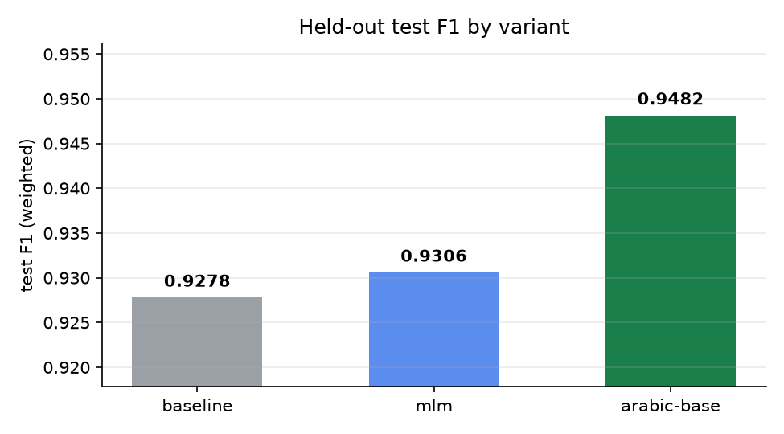
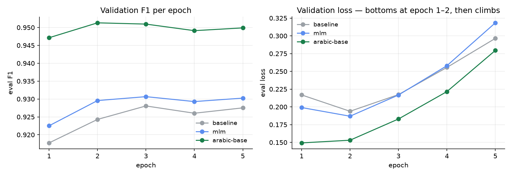

# Encoder Comparison — Arabic Sentiment Classification

Three fine-tuning runs on the same Arabic product-review corpus, differing only
in the base encoder. The goal was to settle two questions before investing
further in the pipeline: whether domain-adaptive MLM pretraining earns its
place, and whether an Arabic-specific encoder beats a multilingual one.

**Result: an Arabic-specific encoder (AraBERTv02) gained +2.04 points of F1 over
the multilingual baseline. Domain-adaptive MLM pretraining gained +0.28, which
is within single-seed noise.** AraBERTv02 is now the served model.

## Setup

| Variant | Base encoder | Layers | Vocab |
|---|---|---|---|
| `baseline` | `distilbert-base-multilingual-cased` | 6 | 119,547 |
| `mlm` | DistilBERT after domain-adaptive MLM on this corpus | 6 | 119,547 |
| `arabic-base` | `aubmindlab/bert-base-arabertv02` | 12 | 64,000 |

Everything except the encoder was held constant: the same train/validation/test
splits, the same normalized text column, learning rate 2e-5, 5 epochs, and
`max_length` 128. Each delta is therefore attributable to the encoder alone.

- **Data:** 247,094 train / 43,241 validation / 18,533 test rows
- **Task:** binary sentiment (positive / negative)
- **Hardware:** RTX 3060 Ti, 12 physical CPU cores
- **Tracking:** MLflow, one run and one registered LoggedModel per variant

## Results



| Variant | test F1 | test accuracy | test loss | Δ F1 vs baseline | Train time |
|---|---|---|---|---|---|
| **arabic-base** | **0.9482** | 0.9481 | 0.1579 | **+0.0204** | 2h 11m |
| mlm | 0.9306 | 0.9306 | 0.2161 | +0.0028 | 1h 18m |
| baseline | 0.9278 | 0.9278 | 0.2205 | — | 1h 21m |

Metrics are computed on the held-out test split, never seen during training or
model selection. `test_f1` is weighted F1.

**Domain-adaptive MLM gained +0.28 points** — a small return for a pretraining
stage that ran 10 epochs over 100k rows, and small enough that a single seed
cannot distinguish it from noise.

**The Arabic-specific encoder gained +2.04 points**, seven times the MLM gain,
and beat the MLM variant by 1.76. Encoder choice dominated everything else
tested.

Notably, AraBERTv02 wins with a *smaller* vocabulary — 64,000 against 119,547 —
so the advantage is not simply more parameters. It has twice the depth but
roughly half the embedding table.

## Training behaviour



| Variant | Best F1 epoch | Min loss epoch | Epochs run |
|---|---|---|---|
| arabic-base | 2 | 1 | 5 |
| mlm | 3 | 2 | 5 |
| baseline | 3 | 2 | 5 |

All three runs overfit early. Validation loss bottoms out at epoch 1–2 and then
climbs monotonically — AraBERTv02 goes from 0.149 to 0.280 — while F1 plateaus.
Because `load_best_model_at_end` is enabled, the saved checkpoint is the
best-F1 epoch in every case, so the reported figures are unaffected. But three
epochs would have produced the same results for roughly 40% less compute.

AraBERTv02's *first* epoch (0.9471) already beat both competitors' *best*
epochs (0.9281 and 0.9307).

Early stopping was configured with patience 3 on `eval_f1` and never triggered:
no run degraded for three consecutive epochs.

## What shipped

The winning checkpoint was exported to ONNX and is what the API serves.

| | |
|---|---|
| Served graph | `models/best_model/model.onnx`, 541 MB |
| Exported from | `models/experiments/arabic-base` |
| Architecture | `BertForSequenceClassification`, 12 layers, 64k vocab |
| Runtime | ONNX Runtime, CPU execution provider |

Export fidelity was verified against the source checkpoint before the model was
promoted, on a sample that includes a 3-token input batched beside a 400-token
one:

| Check | Result | Threshold |
|---|---|---|
| Label agreement | 1.0 | must be exactly 1.0 |
| Padding delta | 0.0 | must be exactly 0.0 |
| Max absolute logit delta | 7.15e-06 | < 1e-4 |

Padding delta is the critical one. The exporter uses hand-written dynamic axes
and had only ever been validated against DistilBERT; AraBERTv02 is a
BERT-family model that derives `token_type_ids` internally. A sequence axis
frozen during tracing would produce correct results on single inputs and only
diverge when a short input is padded up beside a long one. It came back exactly
zero.

### Serving cost

Doubling the depth from 6 layers to 12 roughly doubles CPU latency. Thread
count was re-swept after the swap:

| `intra_op_num_threads` | p50 | p95 |
|---|---|---|
| 2 | 553.5 ms | 1500.8 ms |
| **4** | **95.0 ms** | 163.4 ms |
| 6 | 190.4 ms | 314.7 ms |
| 8 | 279.3 ms | 524.1 ms |

Four threads remains optimal — more threads oversubscribe the cores and cost
more than the parallelism returns. End-to-end serving moved from 95 ms p50 /
163 ms p95, against 67 ms / 83 ms for the 6-layer DistilBERT. That is the price
of the 2.04-point gain.

## Reproducing

```bash
uv sync --extra onnx --extra export --extra train --extra cu121 --extra dev --extra track
```

```bash
python scripts/run_experiments.py --no-export
```

Runs every variant in `config/experiments.yml`, logs each to MLflow, and ranks
them. Dropping `--no-export` additionally exports the winner to ONNX, verifies
it against its checkpoint, and registers it — refusing to publish a graph whose
predictions do not match.

```bash
mlflow ui --backend-store-uri sqlite:///mlruns.db
```

Total runtime for the three variants was approximately 4h 50m on an RTX 3060 Ti.

## Provenance

Each run records the git SHA, a dirty-tree flag, the declared hyperparameters,
and the checkpoint path. Model selection is not an in-process calculation: each
variant registers an MLflow LoggedModel with its test metrics attached to that
`model_id`, and the winner is chosen by `search_logged_models` ordering
server-side — so the ranking is reproducible from the tracking store alone.
